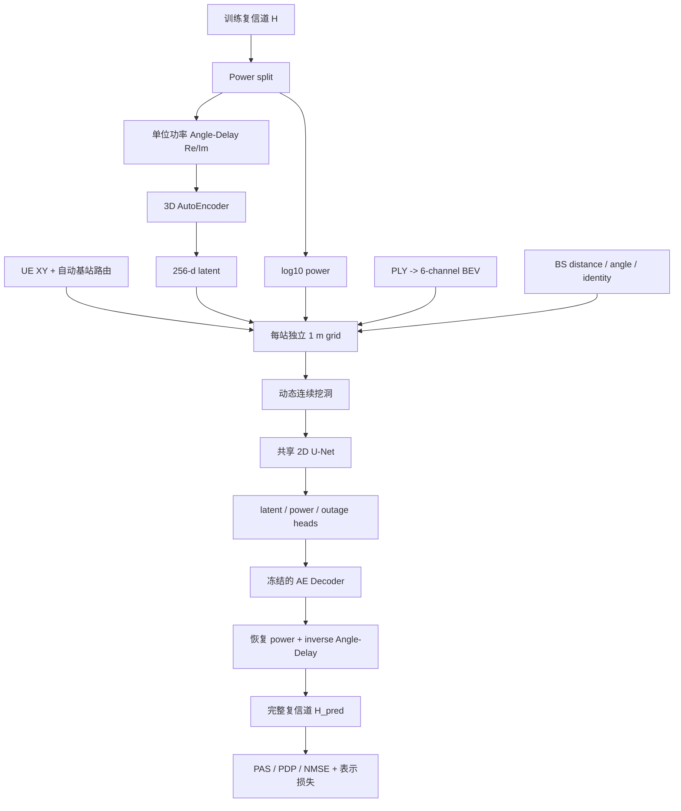

# 方案 A 算法设计说明书

## 1. 目标与边界

本方案按照 `schemeA_spatial_inpainting.md` 实现 Angle-Delay AutoEncoder 与 Spatial U-Net。目标不是把单个 UE 坐标送入 MLP 做点预测，而是把已知信道铺到真实二维空间，训练网络补全连续缺失区域。

首版明确遵守以下边界：

1. 不使用 KNN、邻居距离权重、IDW、幅度后校准或手工邻域插值。
2. 不使用传统射线追踪。
3. 不在首版加入 Transformer、attention、Polar U-Net、Partial Conv 或 Sparse Conv。
4. 保留完整复数信道的实部和虚部，并把整体功率独立建模。
5. Scheme1/Scheme2 保留为历史基线，本方案全部内容位于独立目录。

首版实现 Stage A 和 Stage B：先训练 AE，再冻结 AE 训练空间 U-Net。设计文档中的 Stage C 联合微调属于后续消融，不在第一轮默认开启。这样若结果不理想，可以区分是 AE 重构上限不足，还是空间补洞能力不足。

## 2. 真实数据审计结果

预处理代码直接读取 `Round2_Setup.json`、训练/测试位置、训练信道和 PLY。当前数据的关键事实如下：

| 项目 | 结果 |
|---|---:|
| 训练样本 | 4000 |
| 测试样本 | 500 |
| 原始信道 shape | `(P, 256, 4, 192)` complex64 |
| 基站数 | 2 |
| 每站训练样本 | 2000 / 2000 |
| 每站测试样本 | 250 / 250 |
| exact-zero outage | 262，分站为 130 / 132 |
| 同站最近邻距离中位数 | 2.014 m |
| 同站最近邻距离 P25 / P75 | 1.306 m / 2.874 m |
| 测试点到最近同站训练点距离 | 中位数 6.029 m，最大 18.056 m |
| PLY 顶点 | 19378 |

基站 0 与基站 1 在位置 `y` 方向存在宽约 `61.645 m` 的空区。自动路由得到：

```text
y <= 14.3701229 -> cell 0
y >  14.3701229 -> cell 1
```

正式 1 m 网格为：

| Cell | 网格范围 | shape | 训练点碰撞 |
|---|---|---:|---:|
| 0 | `x=[-70,185), y=[-270,-12)` | `258 x 255` | 63 条额外样本，最大 3 点/cell |
| 1 | `x=[-89,246), y=[41,239)` | `198 x 335` | 65 条额外样本，最大 3 点/cell |

1 m 分辨率的碰撞仅约 3%，而 2 m、4 m 会显著增加碰撞。因此正式配置选择 1 m 网格，并用 `96 x 96` 局部 crop 控制稀疏大图的计算量。

仅使用公开测试坐标、按 6 m 距离连接测试点时，两个站的主要连续组件尺度可达 `37.5 x 45.1 m` 和 `38.3 x 41.1 m`。所以正式动态 hole 的宽、高均采样 12 到 48 m，能覆盖主要测试空洞尺度；这些统计写入预处理 `manifest.json`，没有使用任何测试信道标签。

## 3. 总体架构



## 4. 双基站识别与共享模型

### 4.1 为什么不额外训练分类器

当前两站的位置支持区域完全分离，最大的空区可以给出确定、可审计、训练与测试一致的路由。此时再训练一个基站分类器会引入不必要的分类错误，而且无法比空区规则提供更多信息。

`infer_two_cell_rule` 对 `x/y` 两个轴分别排序，搜索最大空间间隔，并用左右样本数平衡度修正候选分数。它不是手写死 `y=14.37`；该阈值由训练位置自动推断，结果写入 `manifest.json`。测试位置只应用规则，不使用测试信道。

若后续数据出现两个扇区位置重叠，应替换为小型位置分类器或由官方 cell id 路由；当前数据不需要。

### 4.2 为什么每站独立建图

两个基站坐标、朝向、覆盖扇区和信道相位参考不同。把两站信道放进同一张地图会让相邻网格错误共享上下文。因此代码为每站建立独立 `GridSpec` 和输入图，动态 hole 也只在同站内产生。

### 4.3 为什么共享 U-Net

两个站的网络参数共享，以学习建筑遮挡、已知/未知边界和空间连续性的共性。为避免共享网络混淆站点，输入增加 2 个常量 one-hot 通道。设计文档原始建议为 267 通道；当前两站实现为：

```text
256 latent
+ 1 normalized log power
+ 6 BEV
+ 1 observed mask
+ 1 valid mask
+ 1 normalized BS distance
+ 1 normalized relative BS angle
+ 2 BS one-hot
= 269 channels
```

## 5. 功率与完整复信道表示

对每个非零复信道 `H`：

```text
P = mean(|H|^2)
p = log10(P)
H_shape = H / sqrt(P)
```

`H_shape` 的平均复功率为 1，AE 只负责形状、实部、虚部和相位结构；`p` 由空间网络单独预测。恢复时：

```text
H_pred = H_shape_pred * 10^(p_pred / 2)
```

exact-zero 样本不进行对数运算，也不参与 latent、power、PAS、PDP 和非零信道 NMSE 形状训练；它参与 outage BCE。推理时 outage 概率超过阈值则输出严格全零复信道。

## 6. Angle-Delay AutoEncoder

### 6.1 变换

原始基站阵列展平顺序按 `[M_P, M_V, M_H] = [2, 8, 16]` 恢复。对空间维执行正交 2D FFT，对 192 个频点执行正交 IFFT：

```text
[B, 256, 4, 192] complex
-> [B, 2, 8, 16, 4, 192] complex
-> [B, 8, 8, 16, 192] real
```

8 个实通道来自 `2 polarizations x 4 UE channels x Re/Im`。代码中的正变换和逆变换有单元测试，随机复信道可在浮点误差内往返恢复。

### 6.2 网络

Encoder 使用三层 stride-2 3D Conv：

```text
[8, 8, 16, 192]
-> [16, 4, 8, 96]
-> [32, 2, 4, 48]
-> [64, 1, 2, 24]
-> Linear -> latent[256]
```

Decoder 对称使用 Linear 与三层 ConvTranspose3D。每次解码后重新做单位复功率归一化，防止 AE 通过 latent 隐式携带整体幅度。正式 AE 参数约 `1,937,136`，fp32 纯权重约 7.4 MiB。

### 6.3 AE 损失与验收

```text
L_AE = w_ad * MSE(AD_pred, AD_true)
     + w_pas * (1 - PAS cosine)
     + w_pdp * (1 - PDP cosine)
     + w_nmse * log(1 + NMSE)
```

AE 必须先在固定空间验证折上报告 PAS、PDP、NMSE 和官方综合分。它给出后续 U-Net 不可能超过的重构上限。如果 AE 指标低，不能通过继续加大 U-Net 掩盖问题。

## 7. 空间网格与物理输入

### 7.1 PLY 的 6 通道 BEV

PLY 顶点按同一 GridSpec 聚合，生成：

1. 归一化 `log1p(point_count)`；
2. 按全局 PLY 高度范围归一化的 maximum height；
3. `z < 3 m` occupancy；
4. `3 m <= z < 10 m` occupancy；
5. `10 m <= z < 25 m` occupancy；
6. `z >= 25 m` occupancy。

该定义与设计文档和原 Scheme1 的 6 通道 BEV 一致。BEV、信道、mask 与几何特征共享完全相同的原点、分辨率、行列顺序。

### 7.2 Mask 与几何

- `observed_mask=1`：该格当前有可作为输入的真实训练信道，包括已知 outage。
- `valid_mask=1`：位于该站扇区和最大覆盖距离内。
- `distance`：网格中心到基站的水平距离除以 205 m。
- `relative_angle`：网格方向相对扇区中轴的角度除以 61 度。
- `identity`：cell 0/1 one-hot。

扇区中轴不是简单圆均值，而是覆盖全部训练方向的最小圆弧中轴。当前推断中轴为约 `-44.45°` 和 `73.53°`，所有 4000 个训练点和 500 个测试点均在 valid mask 内。

valid mask 先按网格中心的解析扇区生成；对包含已分配 train/test UE 的边界 cell 再显式置 1，避免粗分辨率 smoke 中 cell 中心量化把真实 UE 推到扇区外。该修正只使用公开坐标，不使用测试信道。

### 7.3 Latent 与 power 标准化

AE 编码后，256 个 latent 维度分别使用开发训练折的均值和标准差标准化。power 按基站分别标准化。验证折不参与这些统计，避免泄漏。全量最终配置则使用全部 4000 条训练样本统计。

## 8. 动态连续挖洞

每个 epoch 不枚举固定点，而是生成 `crops_per_epoch` 个训练任务：

1. 随机选择一个基站。
2. 从该站训练区域选锚点。
3. 随机采样宽、高均为 12 到 48 m 的连续矩形 hole。
4. 取包住 hole 的 `96 x 96` crop。
5. 将 hole 内 latent、power 置 0，`observed_mask` 置 0。
6. hole 外真实点仍作为输入上下文。
7. 只在 hole 内真实训练样本的坐标计算监督损失。

每轮的随机种子由全局 seed、epoch 和 crop id 决定，所以可重复，同时每个 epoch 的 hole 都变化。一个 hole 最多采 24 个真实目标用于复信道损失，整块 hole 仍全部从输入中隐藏。

这里的关键区别是：网络一次看到包含环境和洞边界的空间图，卷积特征由多尺度上下文产生；代码没有计算邻居列表、距离权重或校准系数。

## 9. Spatial U-Net

共享 U-Net 使用经典三次下采样、三次上采样和 concat skip connection：

```text
269 -> 32 -> 64 -> 128 -> 256 -> 128 -> 64 -> 32
```

每个 ConvBlock 为两层 `3x3 Conv + GroupNorm + GELU`，并带轻量 Dropout2D。三个 `1x1` head 输出：

- `latent_head`: 256 通道；
- `power_head`: 1 通道；
- `outage_head`: 1 个 logit。

正式 U-Net 参数约 `2,012,098`。AE 与 U-Net 合计约 `3,949,234` 参数，纯 fp32 权重约 15.1 MiB。训练显存主要来自 crop feature、完整复信道、AE Decoder 激活和 FFT，而不是参数。

## 10. 空间训练损失

在 hole 的真实目标位置 gather 三个 head：

```text
L = w_z       * MSE(z_pred, z_true)
  + w_power   * SmoothL1(p_pred_z, p_true_z)
  + w_outage  * weighted_BCE(outage_logit, outage_true)
  + w_pas     * (1 - PAS cosine)
  + w_pdp     * (1 - PDP cosine)
  + w_nmse    * log(1 + NMSE)
```

PAS/PDP/NMSE 前，`z_pred` 经冻结 AE Decoder 还原单位功率信道，再恢复预测功率。outage BCE 的正类权重由当前训练折自动计算，解决 262/4000 的类别不平衡。

配置中的默认权重为：

```text
latent=1.0, power=0.5, outage=0.2,
PAS=0.2, PDP=0.2, NMSE=0.1
```

## 11. 严格空间验证与最终训练

### 11.1 固定空间折

每个基站的位置独立做确定性 k-means++ 空间分块，再把同编号块合成 5 个折。`fold0_4090.json` 使用 fold 0 验证，其余折训练。当前 fold 0 共 823 条，分站为 379/444。

验证构图时：

- fold 0 信道不进入 observed map；
- AE 训练、latent/power 标准化只使用其余折；
- U-Net 只在其余折动态挖洞训练；
- 选模依据固定 fold 0 的官方 score，而不是 train loss。

### 11.2 记录指标

每次空间验证记录：

- PAS、PDP、NMSE、official score；
- latent MSE；
- 标准化 power MAE/RMSE；
- `log10 power` MAE/RMSE；
- outage accuracy、precision、recall、F1。

checkpoint 语义：

- `best.pt`：开发折 official score 最佳；
- `last.pt`：最近断点，供 `--resume`；
- `final.pt`：该次固定轮数训练结束时的状态。

### 11.3 全量最终训练

完成 fold0 选模和 outage 阈值扫描后，`prepare_final_config.py` 读取 AE/U-Net 最佳 epoch 和最佳阈值，生成 `configs/final_selected.json`。该配置令 `validation_fold=null`，AE 与 U-Net 使用全部 4000 条训练数据，训练固定轮数并使用 `final.pt` 推理。

开发折 `best.pt` 可先生成测试结果做诊断，但最终正式版本应优先使用全量 `final.pt`。

## 12. 推理

1. 根据自动 cell rule 将 500 个测试位置分到两个基站。
2. 用全部训练信道构建每站 observed map。
3. 将所有测试坐标对应的网格显式设为 `latent=0, power=0, observed=0`。即使 1 m 量化后与训练点碰撞，也不读取该 cell 的训练信道。
4. 每站整图 padding 到 8 的倍数，执行共享 U-Net 一次。
5. 按原始测试索引 gather latent、power 和 outage 概率。
6. AE 解码、恢复功率、inverse Angle-Delay；outage 输出 exact zero。
7. 保存 `(500,256,4,192)` complex64 NPY，保持官方测试顺序。

## 13. 代码模块映射

| 文件 | 职责 |
|---|---|
| `angle_delay.py` | power split、Angle-Delay 正逆变换、复信道恢复 |
| `autoencoder.py` | 3D AE |
| `spatial_grid.py` | 自动分站、扇区、GridSpec、PLY BEV、空间折 |
| `preprocessing.py` | 真实数据预处理和 manifest |
| `data.py` | mmap 信道数据、空间图、动态连续 hole |
| `unet.py` | 共享 2D U-Net 与整图 padding |
| `autoencoder_training.py` | Stage A 训练、验证、checkpoint、resume |
| `encoding.py` | 冻结 AE 编码及训练折统计 |
| `spatial_training.py` | Stage B、严格空间验证、阈值扫描 |
| `inference.py` | 双站整图推理和 NPY 输出 |
| `metrics.py` | PAS、PDP、NMSE、official score |

## 14. 已完成验收

本机 CPU 已完成：

1. 7 项单元测试全部通过；
2. 真实 6.29 GB 信道文件预处理通过；
3. 自动分站得到训练 2000/2000、测试 250/250；
4. 两阶段小样本训练均完成反向传播并保存 checkpoint；
5. 固定空间验证和 outage 阈值扫描通过；
6. 两个基站各一条测试样本推理通过；
7. 输出 dtype、shape、有限值检查通过。

冒烟 score 很低是正常现象：AE 和 U-Net 各只训练 1 个 epoch，且仅使用极少样本。冒烟只证明数据、梯度、checkpoint、验证和推理链路可执行，不代表比赛精度。

## 15. 风险与后续消融顺序

1. **先看 AE ceiling**：AE PAS/PDP/NMSE 不合格时先提高 AE 容量或训练质量。
2. **看 latent 空间连续性**：若空间近邻 latent 距离无规律，再考虑空间正则或更物理的 latent。
3. **看 power 与 NMSE**：PAS/PDP 上升而 NMSE 不升，优先检查 power head 和相位表示。
4. **看网格量化**：1 m 仍有约 3% 碰撞，第二轮可做 bilinear splatting/sampling。
5. **看稀疏性**：普通 U-Net 无收益时，先调 resolution、crop、hole 和 mask，再考虑 Partial/Sparse Conv。
6. **Stage C**：只有 Stage B 已明显优于点预测基线后，再低学习率联合微调 AE Decoder。

建议消融顺序严格按 `latent+mask -> +power -> +BEV -> +geometry/identity`，不要同时加入多个复杂模块，否则无法判断增益来源。

`scripts/analyze_latents.py` 提供空间最近点与同站随机点的 latent 欧氏距离、余弦相似度对比。它仅用于上述风险诊断，不参与任何信道预测，因此不属于邻居加权算法。
