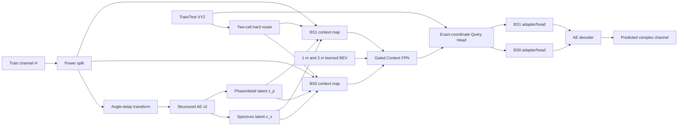

# 方案 B 算法设计说明书

版本：2026-08-16  
项目：Huawei Round 2 双基站信道预测  
实现目录：`schemeB_structured_context_field`

## 1. 设计目标

本方案用于替代已经验证上限不足的 Scheme A。它不使用显式近邻检索、人工距离权重、幅度校准或射线追踪，而是让神经网络学习：

1. 信道在角度-时延域中的结构化低维表示；
2. 每个基站覆盖区内，已有训练信道如何形成空间上下文；
3. 三维精确坐标、基站几何和场景点云到信道潜变量的映射；
4. 两个基站之间可共享的规律，以及每个基站独有的差异。

工程目标是冲击官方 Score `0.70`。该值是优化目标，不是代码能够事先保证的结果。实现通过分阶段诊断避免再次出现“完整模型分数低，却不知道是 AE 还是空间模型造成”的问题。

官方形式的指标组合为：

```text
Score = 0.4 * PAS + 0.4 * PDP + 0.2 / (1 + NMSE)
```

因此 PAS 与 PDP 是主目标，NMSE 和相位/功率恢复是次目标，但不能完全放弃。

## 2. 真实数据事实

预处理程序对当前 Round 2 数据得到以下事实：

| 项目 | 实测值 |
| --- | --- |
| 训练样本 | 4000 |
| 测试样本 | 500 |
| 基站数 | 2 |
| 单样本信道 | complex64 `[256, 4, 192]` |
| 非服务/零信道样本 | 262，基站 0/1 分别为 130/132 |
| 基站 0 训练/测试 | 2000/250 |
| 基站 1 训练/测试 | 2000/250 |
| 服务区分割轴 | y 轴 |
| 分割阈值 | `y = 14.3701 m` |
| 两训练区之间空带 | `61.6450 m` |

两个服务区不是相互混杂的分类问题，而是被一个很宽的空带完全分开。因此最稳妥的做法是：

- 用训练坐标自动发现最大平衡空带；
- 根据基站在该轴上的顺序，将空带两侧路由到基站 0 和基站 1；
- 路由后进入共享 AI 主干和各基站专属 head。

这里不额外训练基站分类器。只有 4000 条样本时，用可被几何规则零歧义解决的问题消耗模型容量，反而会引入错误分类风险。`manifest.json` 会记录阈值、两侧范围和到阈值的最小裕量，便于检查测试分布是否仍满足该规则。

## 3. 总体架构



模型由四部分组成：

1. Structured Angle-Delay Autoencoder v2；
2. 3 m 学习式 cell token pooling；
3. 全图 Gated Context FPN 与 1 m 环境编码器；
4. 精确坐标 Query Head 和每基站专属输出 head。

## 4. 两个基站是否共用一张 latent map

不共用。

预处理后会建立两套完全独立的空间输入：

```text
BS0:
  context_static_cell_0.npz      3 m, [11, 88, 87]
  environment_static_cell_0.npz  1 m, [6, 262, 259]
  仅汇聚 cell_id=0 的训练 latent

BS1:
  context_static_cell_1.npz      3 m, [11, 68, 114]
  environment_static_cell_1.npz  1 m, [6, 202, 339]
  仅汇聚 cell_id=1 的训练 latent
```

共享的是模型参数中的上下文主干，用于学习通用传播规律；不共享的是：

- 实际 latent/context map；
- 基站 embedding；
- 最后一级 adapter；
- spectrum、phase、power、outage 四个输出 head。

这种结构兼顾了样本效率和基站差异。如果完全训练两个独立大模型，每个模型只有 2000 条数据；如果完全共享输出层，又会强迫两个方向、位置和天线环境不同的基站使用同一映射。

## 5. Structured AE v2

### 5.1 功率与形状分解

对每个复信道 `H` 计算平均功率：

```text
p = mean(|H|^2)
H_shape = H / sqrt(p)
log_power = log10(p)
```

零功率样本被标记为 outage，并保持全零。模型分别预测单位功率的信道形状和每基站标准化后的 `log_power`，避免让巨大动态范围破坏结构学习。

这不是旧方案中的“预测后幅度校准”。功率从一开始就是神经网络的显式监督输出，训练和推理使用完全相同的概率模型。

### 5.2 角度-时延变换

输入信道 `[B, M, N, S] = [B, 256, 4, 192]` 被重排为阵列结构，然后执行：

1. 发射阵列二维 FFT，得到角度/波束域；
2. 频率轴 IFFT，得到时延域；
3. 复数拆成实部和虚部。

最终 AE 输入为：

```text
[B, 16, 8, 16, 192]
     C  Mv  Mh   delay
```

变换使用正交归一化，单元测试验证往返误差在浮点容差内。

### 5.3 双分支潜变量

旧 AE 将全局压成一个扁平向量，容易丢失角度峰和时延峰的位置。v2 保留 `2 x 4 x 12` 的角度-时延拓扑：

| 分支 | 输入 | latent shape | 展平维度 |
| --- | --- | --- | --- |
| Spectrum | 8 路复功率的 `log1p` | `[32, 2, 4, 12]` | 3072 |
| Phase/detail | 16 路实部/虚部 | `[16, 2, 4, 12]` | 1536 |
| 合计 | - | - | 4608 |

下采样步长依次为：

```text
(2, 2, 2) -> (2, 2, 2) -> (1, 1, 4)
```

最后一级只压缩时延，不继续破坏角度拓扑。解码器按相反顺序恢复原尺寸，并对输出重新做单位功率归一化。

### 5.4 为什么分成 spectrum 和 phase/detail

PAS 与 PDP 主要依赖功率谱结构，而精确复信道 NMSE 还依赖相位和细节。单潜变量容易让难学的相位占据大量容量，拖累更重要的 PAS/PDP。

本实现同时计算：

- 完整 latent 解码结果；
- 将 phase latent 置零后的 spectrum-only 解码结果。

spectrum-only 也接受 PAS、PDP 和联合功率谱监督，迫使 `z_s` 单独携带稳定的角度/时延功率结构；`z_p` 再补充相位和细节。

### 5.5 AE 损失

正式配置包含：

```text
L_AE =
  1.00 * energy_weighted_AD_MSE
  0.50 * joint_angle_delay_power_loss
  0.80 * (1 - PAS)
  0.80 * (1 - PDP)
  0.10 * log(1 + NMSE)
  0.50 * spectrum_only_(1 - PAS)
  0.50 * spectrum_only_(1 - PDP)
  0.25 * spectrum_only_power_loss
```

能量加权 AD MSE 会提高真实峰值区域的权重，但权重有上限，防止只拟合极少数最强 bin。

## 6. 双分辨率空间表示

### 6.1 为什么不是单纯把栅格从 1 m 改成 3 m

3 m 栅格确实让空间观测更稠密，但会产生坐标碰撞：

- 基站 0：2000 条样本落入 1583 个 cell，额外碰撞 417 条；
- 基站 1：2000 条样本落入 1584 个 cell，额外碰撞 416 条；
- 每个 cell 最多 4 条样本。

如果直接平均信道 latent，同一 cell 内的精确位置差异会被抹掉。因此方案采用：

- 3 m 仅负责建立上下文场；
- 1 m 保留环境细节；
- 每个点携带自己相对 3 m cell 中心的精确 offset；
- 输出在原始连续坐标上查询，而不是读取一个 3 m cell 常数。

### 6.2 学习式 cell pooling

每个训练点的描述向量为：

```text
[z_s, z_p, normalized_log_power, offset_x, offset_y, outage]
```

正式维度为 `4608 + 4 = 4612`。MLP 将点描述变成 token 和 gate，同 cell 多点用可学习加权汇聚，并另外输出：

- observed mask；
- `log(1 + point_count)`。

这与“找邻居后手工算权重”有本质区别：代码没有构造 KNN、距离核或人工加权公式，权重由网络端到端学习，后续 FPN 通过卷积感受野使用全图上下文。

### 6.3 静态场景特征

PLY 点云仅被转成可学习输入，不执行路径搜索或射线追踪。每个 BEV cell 包含 6 个通道：

1. 对数点密度；
2. 归一化最大高度；
3. `<3 m` 占据；
4. `3-10 m` 占据；
5. `10-25 m` 占据；
6. `>=25 m` 占据。

3 m context map 还包含：服务区 mask、到基站距离、相对波束角和 two-cell one-hot，共 11 个静态通道。1 m map 由轻量环境 CNN 编码，在查询位置双线性采样。

## 7. Gated Context FPN

上下文输入为：

```text
[pooled latent token, 3 m static features, observed mask, log_count]
```

FPN 具有三次下采样、skip connection 和 gated convolution。门控卷积可以根据 observed mask、场景特征和 latent 内容抑制无效区域。模型处理整张基站地图，而不是固定半径 KNN，因此能够组合：

- 近处局部连续性；
- 测试空洞两侧的边界信息；
- 建筑/高度特征；
- 更大尺度的覆盖区趋势。

正式 context 输出 96 个通道。地图尺寸在送入网络前补齐为 8 的倍数，输出后裁回原尺寸，避免不同基站地图尺寸导致 shape 错误。

## 8. 精确坐标 Query Head

对每个测试点，从 3 m context feature map 和 1 m environment feature map 进行 `align_corners=False` 双线性采样。Query 向量还包含：

- 相对基站 `dx, dy, dz`；
- 水平距离；
- 相对基站主波束方向的 `sin/cos`；
- 3 m cell 内精确 `offset_x/offset_y`；
- 绝对高度；
- 相对坐标 Fourier features；
- 基站 embedding。

Query MLP 使用 4 个 residual block，宽度 512。共享 MLP 后进入对应基站的 adapter/head，输出：

```text
z_s_hat: 3072
z_p_hat: 1536
power_hat: 1
outage_logit: 1
```

这种设计解决了“3 m 栅格内所有用户预测相同”的问题。

## 9. 动态盲区训练

Context 模型每一步执行：

1. 随机选择一个基站；
2. 在该基站训练点中随机选择矩形中心；
3. 随机生成 `12-36 m` 的矩形盲区；
4. 从输入 map 中隐藏盲区内所有 target latent；
5. 让模型仅根据盲区外上下文和场景预测 target；
6. 限制每步最多 24 个 target，控制显存。

这样训练目标与测试集的成片缺失更接近，而不是随机逐点 mask。

Context 损失为：

```text
1.00 * spectrum_latent_MSE
0.15 * phase_latent_SmoothL1
0.30 * power_SmoothL1
0.02 * outage_BCE
0.80 * (1 - PAS)
0.80 * (1 - PDP)
0.10 * log(1 + NMSE)
0.25 * joint_angle_delay_power_loss
```

低 outage 权重和默认阈值 `0.999` 是有意的：错误地把正常信道清零会严重破坏 NMSE。Fold0 后仍会扫描多个阈值，由验证 Score 决定最终值。

## 10. 三阶段训练

### Stage 1：Structured AE

目标是建立足够高的表示 ceiling。此阶段只使用非 outage 样本，outage 在后续作为单独分类目标。

### Stage 2：Context field

冻结 AE，预先编码所有训练信道；训练 pooling、FPN、Query MLP、BS adapters 和 heads。这样空间模型不会在早期拖动尚未稳定的表示空间。

### Stage 3：Joint fine-tuning

以很小学习率联合训练 Context field 和 AE decoder；两个 encoder 保持冻结。目标是让 decoder 适应“预测得到的 latent”，缩小真实 AE latent 与空间预测 latent 的分布差异。

## 11. 仿测试集验证

随机点验证会高估性能，因为测试点形成空间空洞。预处理采用周期性方形 holdout：

```text
tile = 72 m
hole = 26 m
folds = 5
```

Fold0 有 565 个验证点，两个基站分别 300/265。最近同基站训练点距离与真实测试集非常接近：

| 距离统计 | Fold0 validation | Test |
| --- | ---: | ---: |
| P25 | 4.47 m | 3.65 m |
| Median | 6.50 m | 6.03 m |
| P75 | 9.49 m | 9.07 m |
| Max | 18.27 m | 18.06 m |

这比旧的普通空间聚类 fold 更适合估计最终测试表现。

## 12. 0.70 目标的分阶段门槛

建议按以下顺序判断，而不是直接看最终一次训练：

| 检查点 | 建议门槛 | 低于门槛时优先动作 |
| --- | --- | --- |
| AE full ceiling | Score `>=0.70`，PAS/PDP 均明显高于旧 AE | 调整 AE latent/损失，不训练 Context |
| AE spectrum-only | PAS/PDP 接近 full，差距尽量 `<0.08` | 加强 spectrum-only 监督 |
| Context before joint | 与 AE ceiling 的 Score 差距 `<0.12` | 调整盲区、FPN、Query Head |
| Joint | 比 Context 有稳定增益，最终向 `0.65-0.70+` 推进 | 若无增益则缩短 joint，回到 Context |
| Outage scan | 不允许阈值降低总体 Score | 保持近似禁用 outage 清零 |

这些门槛用于快速止损，不表示达到某一项就保证榜上 `0.70`。公开验证与隐藏测试仍可能存在分布差异。

`scripts/report_stage_gap.py` 会自动输出：

- AE ceiling；
- Context 前后 Score；
- ceiling 到最终模型的 PAS/PDP/NMSE/Score 损失；
- joint fine-tuning 的净收益。

## 13. 推荐消融顺序

若第一轮未达到目标，只改一个因素并保持 Fold0 不变：

1. AE spectrum latent channels：`32 -> 48`；
2. phase latent channels：`16 -> 8/24`，判断相位是否占用过多容量；
3. context resolution：比较 2 m、3 m、4 m，但保留 Query Head；
4. 移除 1 m environment branch，确认点云是否真的贡献；
5. 共享 head 对比 per-BS head；
6. 动态 hole 上限从 36 m 调到 48 m；
7. Query width 从 512 调到 768；
8. 最后再考虑 5-fold ensemble。

不要同时修改多个因素，否则无法判断增益来源。

## 14. 已知风险

1. 精确复相位随空间变化可能非常快，NMSE 上限可能低于 PAS/PDP；因此 phase 权重较低。
2. 20.28M 参数相对 4000 条样本偏大，依靠动态盲区、共享主干、dropout 和 weight decay 控制过拟合。
3. 点云 BEV 只是神经网络特征，不保证网络一定利用；需要消融确认。
4. Fold0 虽然匹配最近支持距离，但测试空洞形状仍不完全相同。
5. `0.70` 可能需要多 fold 或模型 ensemble；当前实现先提供单模型高质量基线和诊断闭环。

## 15. 代码对应关系

| 模块 | 文件 |
| --- | --- |
| 角度-时延变换 | `structured_context_field/angle_delay.py` |
| Structured AE v2 | `structured_context_field/autoencoder.py` |
| AE 训练 | `structured_context_field/autoencoder_training.py` |
| 双分辨率预处理 | `structured_context_field/preprocessing.py` |
| 栅格与路由 | `structured_context_field/spatial_grid.py` |
| latent 编码 | `structured_context_field/encoding.py` |
| 两个基站 map 数据层 | `structured_context_field/context_data.py` |
| Pooling/FPN/Query/BS heads | `structured_context_field/context_model.py` |
| Context 与 joint 训练 | `structured_context_field/context_training.py` |
| 测试集流式生成 | `structured_context_field/inference.py` |
| 指标与损失 | `structured_context_field/metrics.py`, `losses.py` |

