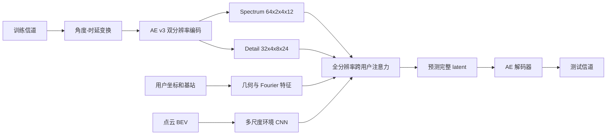

# Scheme C 算法设计说明书

## 1. 文档目的

本方案解决的问题是：已知约 4000 条双基站训练样本的用户坐标、场景点云和信道，预测 500 个测试坐标的信道。

Scheme C 有两个明确目标：

1. 把 AE 的“正确答案压缩后再还原”能力从已观察到的约 `0.722` 继续推向 `0.8`。
2. 不再让 Context 把 30,720 维 latent 强行压成几百维，而是在完整角度-时延结构上预测，使最终 Fold0 分数向 `0.7` 靠近。

`0.7` 是实验目标，不是代码能够预先保证的结果。是否达到目标必须以固定 Fold0 验证集的 PAS、PDP、NMSE 和 Score 为准。

## 2. 为什么重做 Context

Scheme B 可以通俗地理解成下面的过程：

1. 把一条用户信道压成 latent。
2. 把周围所有用户的信息塞进一张特征图。
3. 再把查询坐标变成约 512 维向量。
4. 用一个很大的全连接输出头，从 512 维直接吐出整条 latent。

问题出在第 3、4 步。假设一张高清图片有 30,720 个有结构的像素，旧方法先把它总结成 512 个数字，再要求一次性恢复全部像素。模型即使参数很多，也很容易只学到“平均长什么样”，而丢掉 PAS 最敏感的角度结构。

Scheme C 改为：每个角度-时延位置都是一个 token，每个 token 单独查看同一基站的全部已知用户，再预测这个位置应该是什么。它允许小范围通道投影，但禁止把整条 30,720 维 latent 压成单个小向量。

## 3. 总体流程



完整训练分为三个阶段：

1. `Autoencoder`：只训练信道表示和还原能力，测量表示上限。
2. `Context`：冻结 AE，训练坐标、环境和已知用户到 latent 的映射。
3. `Joint`：用较小学习率同时微调 Context 和 AE 解码器，使最终输出更贴近比赛指标。

## 4. 双基站处理

### 4.1 基站归属

预处理读取训练、测试坐标，在样本分布的最大断点处推断两个服务区域，并根据两个基站在该坐标轴上的顺序绑定 `cell_id=0/1`。这一步的作用类似“先把两个班级的试卷分开”，避免把 A 基站和 B 基站的无线规律混成一套无条件映射。

使用确定性路由的原因是当前数据中两个服务区域在坐标上可分，并且路由误差会直接把整条信道交给错误基站。若以后数据出现两个基站服务区域明显重叠，必须增加单独的软路由分类器并重新验证，不能假设当前规则仍成立。

### 4.2 共享模型而非两套大模型

两个基站共享 AE、环境 CNN、Context 注意力和 latent refiner，只增加一个小型 `station_embedding`。可以把它理解成“同一个专家处理两片区域，但先告诉专家当前是哪一个基站”。

这样做有三个好处：

- 4000 条样本可以共同训练主体，不把每个基站的数据量再次减半。
- 两个基站共同的角度-时延规律可以迁移。
- 基站差异仍可通过 embedding、相对坐标、距离和方位角表达。

## 5. AE v3 设计

### 5.1 输入变换

原始复数信道先转换到角度-时延域。AE 不直接把复数数组当作无结构长向量，而是保留天线垂直角、水平角和时延三个轴。

### 5.2 两个 latent 分支

正式配置使用：

| 分支 | 张量形状 | 元素数 | 主要职责 |
| --- | --- | ---: | --- |
| Spectrum | `[64,2,4,12]` | 6,144 | 功率轮廓、PAS、PDP 主体 |
| Detail | `[32,4,8,24]` | 24,576 | 更细的角度、时延和复数细节 |
| 合计 | 结构化双分支 | 30,720 | 高保真表示 |

降维不是一层完成。编码器通过多层 3D 卷积逐步改变空间尺寸和通道数，保持局部结构；解码器也分多层逐步恢复。Detail 分支保留的角度和时延网格比 Spectrum 更密，避免所有高频细节都挤在低分辨率网格里。

### 5.3 AE 优化点

- 更深的 3D 残差块，正式配置为每级 3 个残差单元。
- Spectrum 和 Detail 使用不同分辨率，而不是完全相同的压缩路径。
- Detail 先暖启动，再逐步增加到完整权重，防止训练初期细节噪声破坏 Spectrum 主体。
- 损失直接包含 PAS、PDP、NMSE、联合功率和复数相干性，而不只优化普通均方误差。
- 每次验证同时报告完整 AE 分数和 `spectrum_only_score`，可以判断 Detail 到底带来增益还是干扰。
- 使用验证分数选择 `best.pt`，而不是固定认为最后一个 epoch 最好。

### 5.4 AE 是否达到目标的判定

AE 验证使用真实验证信道作为输入，然后立即编码、解码。这个分数不包含坐标预测误差，因此近似代表后续 Context 的表示上限。

重点看：

- `artifacts/fold0/autoencoder/evaluation.json` 中的 `metrics.score`。
- `metrics.spectrum_only_score` 与完整 `metrics.score` 的差值。
- PAS、PDP、NMSE 是否同时改善，而不是只提升一个指标。

如果 AE 仍低于 `0.8`，不能宣称 AE 问题已经解决。如果 AE 达到 `0.8` 而 Context 只有 `0.55`，下一步资源应优先投入 Context。

## 6. Context 输入如何整理

旧方案把 latent、功率、偏移量、outage 等直接拼成一个很长的“杂乱点向量”。Scheme C 把输入分成四类，各自编码后再融合。

### 6.1 完整信道 latent

每个已知用户保留：

- Spectrum `[64,2,4,12]`。
- Detail `[32,4,8,24]`。

这两张结构化图不会进入全局 MLP，也不会先求平均。

### 6.2 用户与基站几何

包含相对 `x/y/z`、距离、相对基站主方向的正弦和余弦、栅格内偏移、用户高度，以及多频 Fourier 坐标特征。

举例：两个用户直线距离可能相同，但一个在基站正前方，一个在侧后方。只输入距离无法区分；加入相对方位和 Fourier 特征后，模型可以学习两种位置对应不同的角度谱。

### 6.3 场景环境

点云被转换成 6 通道 BEV：点密度、最大高度和 4 个高度占用区间。环境 CNN 同时生成 1 倍、1/2 和 1/4 分辨率特征。

模型读取两种环境信息：

- 用户落点附近的多尺度环境特征。
- 基站到用户连线上的 16 个采样点，经 CNN 后做均值和最大值汇总。

连线采样只是给神经网络提供“沿途看到了什么”的输入，不计算反射、绕射、路径损耗或人工传播公式，所以它不是传统射线追踪。

### 6.4 稀疏观测地图

3 米 Context 栅格只散射功率、outage、栅格偏移和观测计数等低维摘要，再与静态几何图一起进入 Gated FPN。完整 latent 不进入这张低分辨率地图，因此栅格碰撞不会把两条 30k latent 先平均掉。

## 7. 全分辨率 latent 注意力

### 7.1 token 的含义

Spectrum 有 `2×4×12=96` 个位置，每个位置保存 64 个通道。Detail 有 `4×8×24=768` 个位置，每个位置保存 32 个通道。

模型不会创建一个 30,720 维 token，也不会创建一个 512 维总摘要来代替它。它把每个位置分别投影成内部 token：

- Spectrum：96 个 64 通道 token。
- Detail：768 个 48 通道 token。

内部 Detail 表示为 `768×48=36,864` 个数，本身没有比原 Detail 强行缩小。

### 7.2 跨用户注意力

对每个查询用户、每个 latent 位置，模型查看同一基站的全部可用训练用户。Key/Value 同时包含：

- 该已知用户在当前 latent 位置的值。
- 已知用户的坐标、环境、功率和 outage 条件。
- 当前 latent 位置的角度-时延位置 embedding。

Query 同时包含：

- 测试用户坐标和相对基站几何。
- 测试点局部环境与基站到用户的走廊环境。
- 当前 latent 位置 embedding。

查询用户和已知用户的相对位移通过一个小 MLP 变成 attention bias。权重完全由网络学习，所有观测用户都可以参与；代码没有 KNN 邻居表、手工距离倒数权重或幅度校准公式。

### 7.3 为什么分块计算不等于降维

768 个 Detail 位置一次计算会占用较多显存，所以代码每次处理 16 个 latent 位置。第一个分块算位置 0 到 15，第二个分块算 16 到 31，直到 768 个位置全部算完并按原顺序拼回。

这类似把 768 道题分批批改，并不是只保留 16 道题。`attention_chunk_size` 可以减小显存，但不会删除 latent 内容。

### 7.4 不降采样的 3D refiner

跨用户注意力后，使用深度可分离 3D 卷积和通道 MLP，让相邻角度-时延 token 交换信息。所有块的 stride 都是 1，输入和输出空间尺寸完全相同。

使用普通和膨胀卷积交替，可以同时看近邻和稍远位置，但不会把 768 个位置池化成少量 token。

### 7.5 Spectrum 先行和 Detail 置信门

Context 先预测更稳定的 Spectrum，再把 Spectrum 特征上采样到 Detail 网格，作为 Detail 分支的条件。最后模型为每个 Detail bin 预测置信度。

如果某个细节位置缺少证据，置信门可以把归一化 Detail 拉向 0，也就是训练集均值，而不是输出幅度很大的随机细节。这个机制主要用于保护 NMSE 和 PAS。

## 8. 证明没有全局 latent 瓶颈

执行：

```bash
python scripts/inspect_architecture.py --config configs/fold0_5090.json
```

当前正式配置应报告：

```text
spectrum_elements       = 6144
detail_elements         = 24576
total_latent_elements   = 30720
full_latent_linear_layers = []
full_resolution_check   = true
```

当前实测参数量约为：

- AE：5,239,632。
- Context：6,053,636。
- Context 最大 Linear 权重只有 131,072 个参数，即 `512×256`，远小于旧式 `512×30720` 输出头。

注意：参数少于旧方案不代表算力更低。Scheme C 的主要算力来自“每个 latent 位置对全部用户做注意力”，属于按数据动态计算，而不是把参数堆在一个大输出矩阵里。

## 9. 训练样本遮挡策略

Context 训练不能直接拿测试标签，所以在训练样本中人工挖洞：把某片区域的用户隐藏，要求模型根据剩余用户预测隐藏用户。

Scheme C 随机使用四种洞：

- 矩形区域。
- 椭圆区域。
- 随机方向的狭长条带。
- 两个相连或部分重叠的椭圆区域。

这比永远使用规则方框更接近测试点可能形成的不规则缺口。配置还以一定概率选择 outage 样本作为洞中心，避免每个 batch 都没有 outage。

正式配置默认让同一基站全部非隐藏用户参与注意力。`maximum_observations=0` 表示不设上限。如果显存或时长实在不足，可以随机限制观测数量，但这属于速度折中，必须重新做 Fold0 对照，不能直接认为分数不变。

## 10. 损失函数

Context 同时优化：

| 损失 | 作用 |
| --- | --- |
| Spectrum latent MSE | 学准主要功率和角度-时延轮廓 |
| Detail latent Smooth L1 | 学细节，同时降低极端异常值影响 |
| Power Smooth L1 | 学习整条信道的绝对功率 |
| Balanced outage BCE | 处理 outage 数量不平衡 |
| PAS loss | 直接对齐比赛角度谱指标 |
| PDP loss | 直接对齐功率时延谱指标 |
| NMSE loss | 控制整体复数误差 |
| Joint power loss | 约束角度-时延联合功率分布 |

`outage_positive_weight=0` 不是关闭 outage，而是自动用训练集中非 outage 与 outage 的数量比例计算正样本权重。

## 11. 训练停止规则

Fold0 配置把 epoch 设为较大的上限，而不是预言“必须训练 135 次”。实际停止由以下规则共同决定：

1. 验证 Score 长时间没有超过最小改善量时早停。
2. 验证分数进入平台后自动降低学习率。
3. 每个阶段达到最大运行小时数时停止，并保存 `last.pt` 和 `final.pt`。
4. 达到最大 epoch 时停止。
5. `stop_at_target=false`，达到 0.7 或 0.8 后仍允许继续寻找更高分；目标只用于报告。

时间限制在一个 epoch 完成后检查，所以可能比配置值多运行一个 epoch 的时间。

## 12. Checkpoint 含义

- `best.pt`：验证 Score 最高的模型，用于 Fold0 评价和选择超参数。
- `last.pt`：最近一个完整 epoch 的模型、优化器、学习率调度器和 AMP 状态，用于断点续训。
- `final.pt`：本次命令退出前保存的模型。它可能因时间上限退出，不等于一定收敛。

因此续训必须从 `last.pt` 恢复，不能只根据存在 `final.pt` 就判断训练已经完成。

## 13. 结果诊断

Fold0 完成后重点读取：

```text
artifacts/fold0/autoencoder/evaluation.json
artifacts/fold0/context/evaluation.json
artifacts/fold0/joint/evaluation.json
artifacts/fold0/stage_gap.json
artifacts/fold0/joint/outage_scan.json
```

建议按下面顺序判断：

1. AE 分数低于 0.8：表示还原上限不足，先看 Spectrum/Detail 贡献。
2. AE 较高但 Context 低很多：表示坐标和环境到 latent 的预测仍是主瓶颈。
3. Context 的训练 latent 误差很低、验证误差很高：表示空间过拟合，应调整遮挡、正则或输入，而不是继续扩大训练 epoch。
4. Joint 几乎没有增益：缩短 Joint，把算力给 Context。
5. outage F1 很低但 outage 很少：以阈值扫描后的最终 Score 为准，避免仅为分类指标牺牲大量非 outage 样本。

`stage_gap.json` 会自动计算 AE ceiling 到 Context/Joint 的分数损失，避免再次凭感觉判断是哪一段出了问题。

## 14. 推荐消融实验

达到稳定基线后，每次只改一项，并保持 Fold0、随机种子和训练预算相同：

| 实验 | 目的 |
| --- | --- |
| 去掉 corridor，只保留局部环境 | 判断沿途环境是否真实贡献 |
| Detail 置信门固定为 1 | 判断门控是否保护 NMSE/PAS |
| `maximum_observations=1024` 对比全部观测 | 衡量全局上下文与速度的关系 |
| 去掉 Spectrum 对 Detail 的条件 | 判断分层预测是否有效 |
| 规则方洞对比混合洞 | 判断不规则遮挡是否改善泛化 |
| 两套独立基站模型对比共享模型 | 判断共享知识是否有益 |

不要一次同时修改三四项，否则即使分数上升，也无法知道真正有效的部分。

## 15. 已知风险

- 0.7 仍需要真实 5090 Fold0 训练验证，CPU 冒烟只能证明代码链路正确。
- 4000 条样本对 30,720 维输出仍然是小数据问题，大模型并不自动等于高分。
- 当前服务基站路由依赖两个坐标区域可分；数据规则变化后必须重新检查。
- 全观测、全 latent 注意力计算量较大，实际速度取决于 PyTorch SDPA、显卡驱动和地图尺寸。
- 最终全量训练没有验证标签，不能从最终日志直接得到可信比赛分数；可信分数来自 Fold0。

## 16. 代码位置

| 文件 | 职责 |
| --- | --- |
| `scheme_c/autoencoder.py` | AE v3 双分辨率编码器和解码器 |
| `scheme_c/autoencoder_training.py` | AE 损失、验证、早停和限时 |
| `scheme_c/encoding.py` | 生成结构化 latent 和归一化统计 |
| `scheme_c/context_data.py` | 双基站数据、几何、走廊坐标和混合遮挡 |
| `scheme_c/context_model.py` | 多尺度环境、全分辨率注意力和 refiner |
| `scheme_c/context_training.py` | Context/Joint 训练、评测、GPU 缓存和续训 |
| `scheme_c/inference.py` | 分批解码并写入最终 complex64 NPY |
| `configs/fold0_5090.json` | 5090 Fold0 正式验证配置 |
| `configs/final_5090.json` | 全量最终训练模板 |
| `configs/smoke.json` | 极小样本链路验证配置 |
