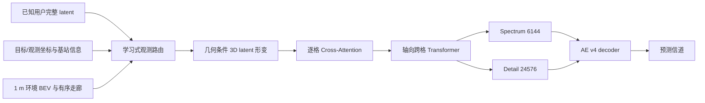

# Context V2 算法设计说明书

版本：`geometry_warped_context_v2`
适用配置：`configs/fold0_5090.json`、`configs/final_5090.json`

## 1. 设计结论

Context V2 不再假设“目标用户的某个 angle-delay 格，只能参考观测用户的同一个格”。它先学习哪些观测用户有用，再根据目标与观测用户的坐标、环境和基站关系，对完整 latent 体做连续形变，最后在完整 30,720 维结构上预测信道。

可以把它理解成：先找到可能描述同一批传播路径的观测用户，把这些用户的路径峰值移动到目标用户应出现的位置，然后再由神经网络融合，而不是把所有人的同号格直接平均。

## 2. 已知条件与目标

数据集包含：

- 4000 条训练信道；
- 500 个测试用户；
- 两个基站，每个基站 2000 条训练、250 条测试；
- 原始信道 shape 为 `[P,256,4,192]`；
- AE v4 Fold0 重建 Score 为 `0.9490919`；
- AE Spectrum-only Score 为 `0.5935195`；
- Context Fold0 研究目标为 `0.70`。

`0.70` 不是代码能够保证的结果。AE 的 `0.9491` 只说明“给定真实信道后可以高质量压缩和还原”，不说明坐标与环境一定能够预测出相同 latent。

## 3. 为什么不能继续使用 Context V1

### 3.1 训练洞没有完整隐藏

旧实现先找到一个空间洞，然后在洞内用户超过 16 个时只随机隐藏 16 个。其余洞内用户继续作为观测输入。

对正式 Fold0 配置模拟 10000 个旧训练洞：

| 指标 | 旧实现 |
|---|---:|
| 洞内用户中位数 | 27 |
| 超过 16 个用户的洞 | 77.2% |
| 超限洞平均残留洞内用户 | 19.5 |
| 目标到最近观测用户中位距离 | 3.08 m |
| Fold0 验证中位距离 | 6.50 m |
| 测试中位距离 | 6.03 m |

这不是直接把目标标签复制给模型，但会使训练空间插值明显比验证和测试简单。

### 3.2 同格注意力不能表示路径移动

用户移动后，路径的到达角和时延会变化。V1 在融合观测用户时，每个目标 latent 位置只读取相同 latent 位置。后置 3D 卷积可以做统一修补，但不能针对每一对“目标用户－观测用户”执行不同的路径移动。

### 3.3 参数用在了错误位置

V1 共约 605 万参数，但 Spectrum 与 Detail 信道预测分支合计仅约 24 万参数，环境编码器约 2.75 万参数。大部分容量位于低维地图 FPN 和坐标 MLP。

AE 消融已经证明 Detail 能带来约 `0.3556` Score 增益，所以 Detail 预测不能继续作为小型附属分支。

## 4. 完整数据流



## 5. 双基站处理

基站归属仍使用预处理阶段推导出的确定性空间分界。当前数据中训练区间之间存在约 `61.6 m` 间隙，测试用户距离分界至少约 `46.2 m`，因此基站识别不是主要误差来源。

V2 对两个基站采用：

- 同一套共享主干，利用两个基站的数据共同学习；
- 每个基站独立的 Spectrum/Detail 均值和标准差；
- 每个基站独立的 latent FiLM 缩放与偏置；
- 每个基站独立的功率归一化；
- 只允许目标读取所属基站的观测用户。

共享主干减少 2000 条样本下的过拟合，基站适配器处理两个基站 latent 分布和天线方向的差异。

## 6. AE latent 接口

AE v4 不变：

| 分支 | shape | 元素数 |
|---|---:|---:|
| Spectrum | `[64,2,4,12]` | 6144 |
| Detail | `[32,4,8,24]` | 24576 |
| 合计 | - | 30720 |

`encoding.py` 使用训练 split 内、非 outage 样本分别统计两个基站的 latent 均值和标准差。正式配置使用 float32 保存 `encoded.npz`，避免在 Context 输入前额外量化 Detail。

V2 不存在输入或输出维度达到 30,720 的全连接层。最大的单个 Linear 权重为 524,288 个参数，完整结构检查由以下命令完成：

```bash
python scripts/inspect_architecture.py --config configs/fold0_5090.json
```

## 7. 测试分布匹配的完整区域掩码

训练时区分两个集合：

- `targets`：本 step 真正计算信道损失的最多 12 个用户；
- `hidden`：整个模拟测试区域内必须从观测端删除的全部用户。

即使一个区域包含 80 个用户，也可以只对其中 12 个计算损失，但 80 个用户都不能进入 Context 输入。

70% 的训练掩码使用真实无标签测试坐标构成的连通组件模板，另外 30% 使用矩形、椭圆、走廊和复合形状。这里只使用比赛给出的测试坐标，不使用测试信道标签。

正式配置 2000 次掩码检查结果：

| 指标 | Context V2 |
|---|---:|
| target 数中位数 | 12 |
| 完整 hidden 数中位数 | 18 |
| hidden 数 P95 | 67 |
| 最近观测距离中位数 | 6.456 m |
| Fold0 验证中位数 | 6.500 m |

运行前门禁：

```bash
python scripts/analyze_context_masks.py \
  --config configs/fold0_5090.json \
  --output artifacts/fold0/context_mask_report.json
```

中位支撑距离不在 `[4.5,8.0] m` 时，正式脚本停止训练。

## 8. 学习式观测路由

每个基站约有 1700 条 Fold0 训练观测。直接对全部观测用户、全部 latent 格执行跨格注意力会浪费显存并稀释有效路径。

路由器先对全部观测用户计算一个低成本神经相关度，输入包括：

- 目标和观测用户的学习特征；
- 相对 x/y；
- 绝对相对位移；
- 二者距离；
- 到基站距离差；
- 相对方向的点积、叉积、正弦和余弦关系；
- 局部环境、功率和 outage 信息。

然后选出 64 个候选进入完整 latent 计算。

这与旧近邻算法不同：

- 不是按欧氏距离固定选 KNN；
- 没有手写距离权重；
- 没有人工幅度校准；
- 路由只选择神经消息候选，不直接生成最终信道；
- 远处但环境和传播模式相关的用户仍可被选中。

## 9. 几何条件 latent 形变

对每一对“目标用户－候选观测用户”，网络预测三个连续偏移：

- angle-v 偏移；
- angle-h 偏移；
- delay 偏移。

偏移通过 5D `grid_sample` 对观测 latent 做可微分三线性采样。Spectrum 和 Detail 使用不同最大范围：

| 分支 | 最大 `(angle-v, angle-h, delay)` 偏移 |
|---|---:|
| Spectrum | `(0.75,1.5,3.0)` 格 |
| Detail | `(1.5,3.0,6.0)` 格 |

偏移完全由神经网络学习，不使用传统射线追踪路径计算。

## 10. 跨格融合与 Detail 主干

形变后的候选 latent 在每个位置做多头 Cross-Attention。之后使用两类模块：

- 带角度循环 padding 的 3D depthwise residual blocks；
- 分别沿 delay 轴和 angle 平面执行注意力的 Axial Transformer。

因此输出不仅能读取对齐后的同格信息，还能在完整角度和时延范围内交换信息。

旧版无监督 `detail_confidence` 已删除。Detail 直接输出，不再允许模型通过把 confidence 压低而逃避 Detail 学习。

## 11. 环境编码

输入仍是 1 m BEV：点密度、最大高度和四个高度占用区间。

V2 使用 ConvNeXt 风格三层特征金字塔，并对基站到用户的 24 个采样点保留原始顺序。Corridor Transformer 使用 CLS token 汇总路径，不再只保存均值和最大值。

因此“墙靠近基站”和“墙靠近用户”不会天然变成相同输入。

## 12. 单次端到端训练

V2 不再运行单独 Joint 阶段。一次 Context 训练同时包含：

- Context 主模型，学习率 `2e-4`；
- AE decoder，学习率 `3e-6`；
- AE encoder 冻结，encoded latent 固定。

decoder 同时接收真实 latent 重建约束，防止为了适应预测 latent 而破坏已经验证的 AE 能力。

## 13. 损失函数

主要损失直接对齐官方指标：

```text
0.4 * (1 - PAS)
+ 0.4 * (1 - PDP)
+ 0.2 * NMSE / (1 + NMSE)
```

该式严格等于 `1 - 官方 Score`。单独记录的 `nmse` 辅助项仍使用 `log(1 + NMSE)` 保持数值稳定，但正式 Context 权重只启用上面的精确 Score 项。

辅助项及正式权重：

| 损失 | 权重 | 作用 |
|---|---:|---|
| score surrogate | 1.0 | 直接优化比赛目标 |
| Spectrum latent | 0.12 | 保持粗粒度功率结构 |
| Detail latent | 0.06 | 约束完整 Detail 数值 |
| Detail correlation | 0.10 | 防止 Detail 方向无关 |
| scalar power | 0.12 | 约束总功率 |
| outage BCE | 0.03 | 识别零信道 |
| joint angle-delay power | 0.10 | 约束联合功率图 |
| decoder teacher | 0.15 | 保护 AE decoder |
| warp regularization | 0.002 | 防止形变长期饱和 |

latent 损失不再以 1.0 的权重压过比赛指标。

## 14. Outage 选择

训练使用正样本权重 4.0，低于旧自动类别比例约 14。每次正式验证同时检查多个 threshold，按真实 Fold0 Score 选最佳值。训练结束后 `scan_outage.py` 再扫描并保存：

```text
artifacts/fold0/context/outage_scan.json
```

最终推理使用该报告中的阈值，而不是固定假设 `0.999` 最优。

## 15. 正式模型规模

当前检查结果：

| 项目 | 参数量 |
|---|---:|
| Context V2 总参数 | 18,614,162 |
| 地图 FPN | 2,275,800 |
| 环境 + corridor | 1,258,320 |
| 学习式路由 | 501,889 |
| Spectrum field | 2,264,099 |
| Detail field | 3,192,035 |

Detail field 相比 V1 的约 9.2 万参数扩大到约 319 万，同时全 latent 结构保持不变。

## 16. 训练停止条件

Fold0 Context 配置：

- 最多 1000 epochs；
- 每 epoch 24 个完整空间掩码；
- 每 5 epochs 验证；
- 50 epochs 无提升早停；
- 墙钟时间硬限制 6.75 小时；
- 达到 0.70 后仍继续寻找更好 checkpoint，除非手动启用 `stop_at_target`。

epoch 不是预估收敛轮数，墙钟限制和验证早停才是实际边界。

## 17. 一次训练必须输出的诊断

每个验证记录包含：

- PAS、PDP、NMSE、Score；
- Spectrum/Detail latent MSE；
- 功率误差；
- outage precision、recall、F1 和最佳 threshold；
- router entropy；
- 路由候选平均归一化距离；
- Spectrum/Detail 平均形变格数。

这些指标不需要额外训练消融，仍然属于同一次正式运行。

## 18. 风险与判定

主要剩余风险是高频复信道 Detail 可能随位置变化过快，4000 条数据未必足以预测到 AE 重建水平。因此：

- AE `0.9491` 是表示上限，不是 Context 预期分数；
- Context V2 冒烟分数没有统计意义；
- 只有 5090 Fold0 的 565 条验证结果可以决定方案是否达到目标；
- 若 Fold0 仍低，应先看 router、warp、Spectrum-only 和 Detail 诊断，再决定是否继续，而不是盲目增加 epoch。
